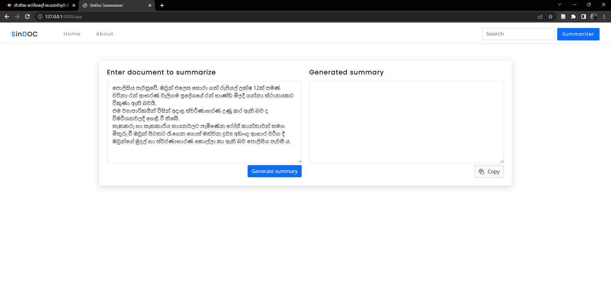

# SinDOC: A Combined Approach of Summarizing Low Resource Sinhala Language Documents

___

The preprint of the research can be accesssed through this [SinDOC: A Combined Approach of Summarizing Low Resource Sinhala Language Documents](https://www.researchgate.net/publication/371178238_SinDOC_A_Combined_Approach_of_Summarizing_Low_Resource_Sinhala_Language_Documents)

The explanation of the research can be found in the following video.

